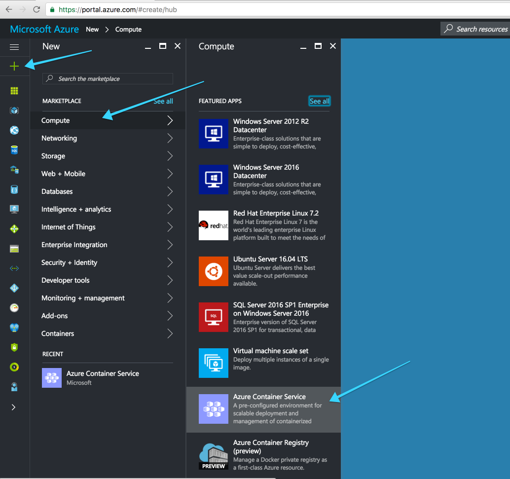
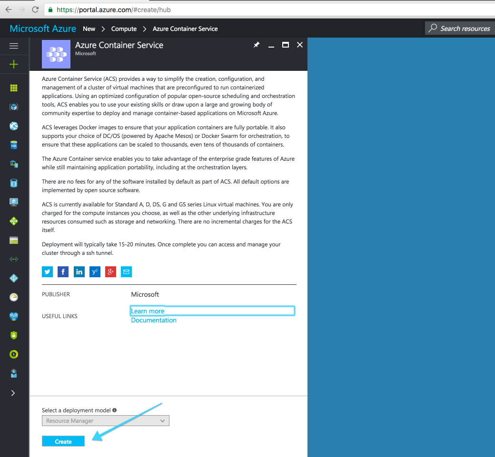
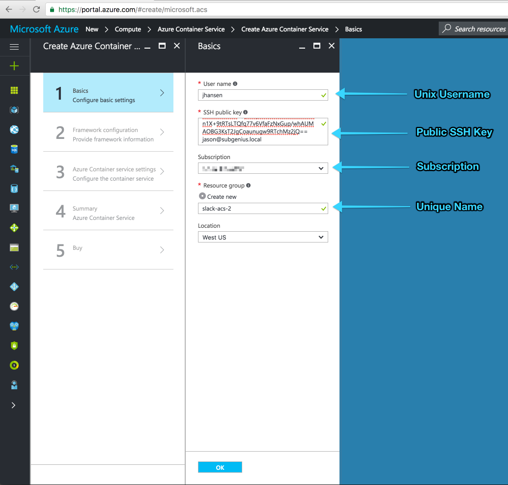
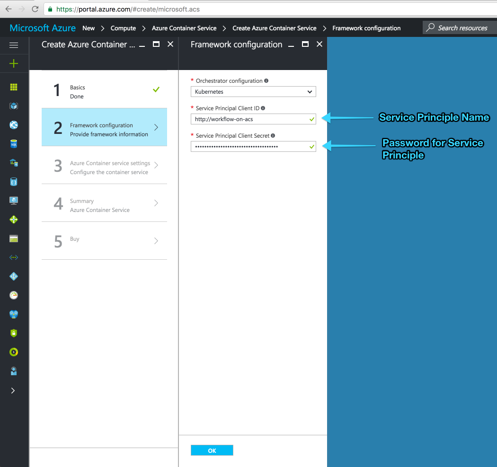
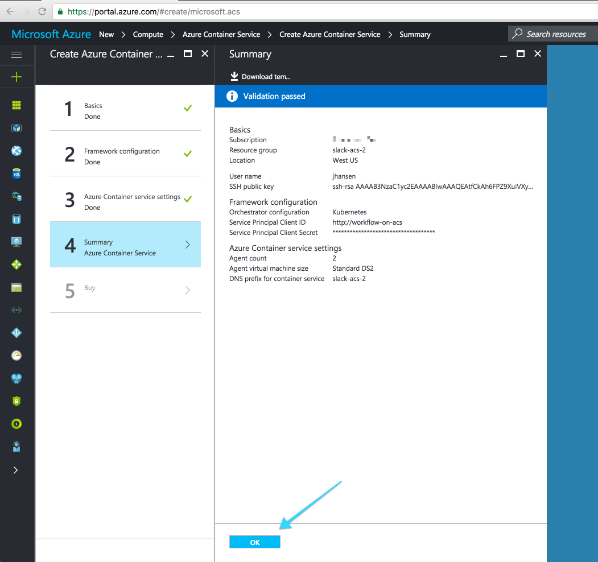

# Booting Kubernetes on Azure Container Service

Azure Container Service (ACS) is an optimized container hosting solution that works
with all the open source tools you know. Azure is great for Kubernetes and Deis Workflow.

If you don't yet have a Microsoft Azure account, start a trial with $200 of free credit
[here](https://azure.microsoft.com/en-us/free/).

## Prerequisites

1. You should be able to run the `az` command, which is used to provision resources in the Azure
cloud. Either [install Azure CLI to your computer][] or open a [Cloud Shell][] by clicking
this icon near the upper right of the [Azure Portal][]: 

1. You need an SSH key to deploy the Kubernetes cluster. For help, see Microsoft's documentation
about [creating SSH key pairs][] for Linux VMs on Azure.

## Configure the Azure CLI

If you use [Cloud Shell][], the `az` client command is already configured.

If you installed `az` locally, log in to your Azure account by typing `az login` at a command
prompt and complete the confirmation code process.

You can verify which account is active with the `az account show` command.

!!! note
    Your Azure account needs ownership or contributor permissions on an Azure subscription.

    If the subscription has 2FA enabled, your Azure account must have ownership credentials in
    order to create the service principal.

## Create an ACS Kubernetes Cluster

Azure Container Service can create a Kubernetes cluster using either
[the `az` command line](#option-1-command-line) or [the Azure web portal](#option-2-web-portal).

### Option 1: Command Line

Create a group to contain the ACS Kubernetes cluster resources. Export the resource group's name
and location to environment variables for use by later commands:

```
$ # list worldwide datacenter locations so we can pick one
$ az account list-locations --query [].name --output tsv
$ export AZURE_DC_LOCATION=southcentralus  # for example
$ export AZURE_RG_NAME=myresourcegroup
$ az group create --name "${AZURE_RG_NAME}" --location "${AZURE_DC_LOCATION}"
```

Run the `az acs create` command to create your Kubernetes cluster, replacing the `--dns-prefix`
and `--ssh-key-value` arguments below with your values:

```
$ export AZURE_SERVICE_NAME=myacs
$ export AZURE_DNS_PREFIX=mydnsprefix
$ az acs create --resource-group="${AZURE_RG_NAME}" --location="${AZURE_DC_LOCATION}" \
  --orchestrator-type=kubernetes --master-count=1 --agent-count=1 \
  --agent-vm-size="Standard_D2_v2" \
  --admin-username="k8sadmin" \
  --name="${AZURE_SERVICE_NAME}" --dns-prefix="${AZURE_DNS_PREFIX}" \
  --ssh-key-value @$HOME/.ssh/id_rsa.pub
```

Azure Container Services immediately begins creating the Kubernetes cluster. After a few minutes,
the command returns with information about the new deployment:

```
{
  "id": "/subscriptions/a123b456-1234-1ab2-12ab-12345678abcd/resourceGroups/myresourcegroup/providers/Microsoft.Resources/deployments/azurecli1496357873.8344654",
  "name": "azurecli1496357873.8344654",
  "properties": {
    "correlationId": "eae284bc-4380-484c-9302-f355e278c651",
    "debugSetting": null,
    "dependencies": [],
    "mode": "Incremental",
    "outputs": null,
...
  },
  "resourceGroup": "myresourcegroup"
}
```

Your Kubernetes cluster on Azure is ready. Skip the next section and
[connect to the ACS Kubernetes cluster](#connect-to-the-acs-kubernetes-cluster).

### Option 2: Web Portal

Sign in to the [Azure Portal](https://portal.azure.com) and create a new Azure Container Service.
Click on the **+ New** link, then the **Compute** link, then **Azure Container Service**.



Select **Resource Manager** as the deployment model:



Then click the **Create** button.

### Basics

Provide these *Basics* for a new Azure Kubernetes cluster:

- Orchestrator: **Kubernetes**
- Subscription: choose the Azure subscription to be charged for cloud resources
- Resource group: "Create new" with a unique name
- Location: choose one of Azure's worldwide datacenters



Then click the **OK** button to move on to [Master configuration](#master-configuration).

### Master configuration

First take a slight detour to [create a service principal][] to access resources. Then supply the
**Master configuration** options for your Kubernetes cluster:

- DNS name prefix: the first section of the cluster's hostname
- User name: name of a unix user who will be added to all Kubernetes nodes
- SSH public Key: a public key to authenticate the unix user specified above
- Service principal client ID: the `appId` field of the service principal
- Service principal client secret: the `password` field of the service principal
- Master count: number of Kubernetes masters for the cluster



When you are satisfied with your choices, click **OK** to move on to
[Agent Configuration](#agent-configuration).

### Agent configuration

Choose **Agent configuration** options for your Kubernetes cluster:

- Agent count: number of Kubernetes nodes to create
- Agent virtual machine size: "Standard DS2" or better is recommended
- Operating system: Linux


When you are satisfied with your choices, click **OK** to move on to [Summary](#summary).

### Summary

Confirm the **Summary** of configuration choices for your Kubernetes cluster:



Click **OK** to tell Azure Container Services to start creating your new Kubernetes cluster. You
can monitor the progress of the deployment on the Azure dashboard, or just wait for a
notification that it has completed.

Your Kubernetes cluster on Azure is ready. Now make sure you can
[connect to the ACS Kubernetes cluster](#connect-to-the-acs-kubernetes-cluster).

## Connect to the ACS Kubernetes Cluster

`kubectl` is the Kubernetes command line client.  If you don't already have it installed, you can install it with:

```
az acs kubernetes install-cli
```

Download the master kubernetes cluster configuration to the ~/.kube/config file by running the following command:

```
az acs kubernetes get-credentials --resource-group=$AZURE_RG_NAME --name=$AZURE_SERVICE_NAME
```

 > Note: If the cluster was provisioned using any other SSH key than `/home/myusername/.ssh/id_rsa` then the `--ssh-key-file` parameter must be used pointing to the SSH key utilized to provision the cluster.

Verify connectivity to the new ACS Kubernetes cluster by running `kubectl cluster-info`

```
$ kubectl cluster-info
Kubernetes master is running at https://mydnsprefix.myregion.cloudapp.azure.com
Heapster is running at https://mydnsprefix.myregion.cloudapp.azure.com/api/v1/proxy/namespaces/kube-system/services/heapster
KubeDNS is running at https://mydnsprefix.myregion.cloudapp.azure.com/api/v1/proxy/namespaces/kube-system/services/kube-dns
kubernetes-dashboard is running at https://mydnsprefix.myregion.cloudapp.azure.com/api/v1/proxy/namespaces/kube-system/services/kubernetes-dashboard
```

You are now ready to [install Deis Workflow](install-azure-acs.md)

[Azure Portal]: https://portal.azure.com/
[install Azure CLI to your computer]: https://docs.microsoft.com/en-us/cli/azure/install-azure-cli
[Cloud Shell]: https://azure.microsoft.com/en-us/features/cloud-shell/
[create a service principal]: https://docs.microsoft.com/en-us/azure/container-service/container-service-kubernetes-service-principal
[creating SSH key pairs]: https://docs.microsoft.com/azure/virtual-machines/virtual-machines-linux-mac-create-ssh-keys
