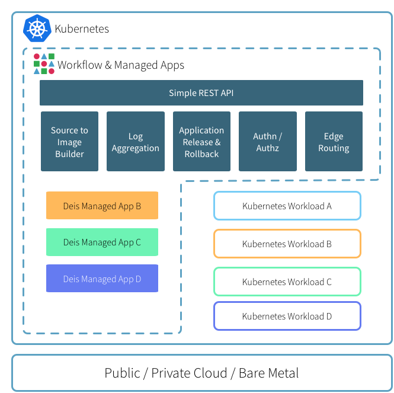

# Architecture

Deis Workflow is built using a service oriented architecture. All components
are published as a set of container images which can be deployed to any
compliant Kubernetes cluster.

## Overview

Operators use [Helm Classic][helm] to configure and install the Workflow components which
interface directly with the underlying Kubernetes cluster. Service discovery,
container availability and networking are all delegated to Kubernetes, while
Workflow provides a clean and simple developer experience.

## Platform Services

Deis Workflow provides additional functionality to your Kubernetes cluster, including:

* [Source to Image Builder][builder] which compiles your Application code via Buildpacks or Dockerfiles
* [Cross-Pod Log Aggregation][logger] which gathers logs from all of your Application processes
* [Simple REST API][controller] which powers the CLI and any external integrations
* Application release and rollback
* Authentication and Authorization to Application resources
* [HTTP/HTTPS edge routing][router] for your Applications

## Kubernetes-Native

All platform components and applications deployed via Workflow expect to be
running on an existing Kubernetes cluster. This means that you can happily run
your Kubernetes-native workloads next to applications that are managed through
Deis Workflow.

## Application Layout and Edge Routing

By default Workflow creates per-application Namespaces and Services so you can
easily connect your applications to other on-cluster services through standard
Kubernetes mechanisms.

The router component is responsible for routing HTTP/s traffic to your
Applications as well as proxying `git push` and platform API traffic.

By default, the router component is deployed as a Kubernetes service with type
`LoadBalancer`; which, depending on your configuration, will provision a
cloud-native load balancer automatically.

The router automatically discovers routable Applications, SSL/TLS certificates
and application-specific configurations through the use of Kubernetes
annotations. Any changes to router configuration or certificates are applied
within seconds.

## Topologies

Deis Workflow no longer dictates a specific topology or server count for your
deployment. The platform components will happily run on single-server
configurations as well as multi-server production clusters.

[builder]: components.md#builder
[components]: components.md
[controller]: components.md#controller
[helm]: http://helm.sh
[logger]: components.md#logger
[router]: components.md#router
