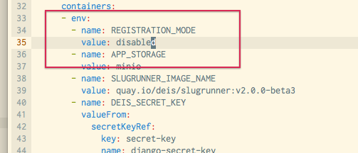

# Users and Registration

There are two classes of Workflow users: normal users and administrators.

 * Users can use most of the features of Workflow - creating and deploying applications, adding/removing domains, etc.
 * Administrators can perform all the actions that users can, but they also have owner access to all applications.

The first user created on a Workflow installation is automatically an administrator.

## Register with a Controller

Use `deis register` with the [Controller][] URL (supplied by your Deis administrator)
to create a new account. After successful registration you will be logged in as the new user.

    $ deis register http://deis.example.com
    username: myuser
    password:
    password (confirm):
    email: myuser@example.com
    Registered myuser
    Logged in as myuser

!!! important
    The first user to register with Deis Workflow is automatically becomes an administrator. Additional users who register will be ordinary users.

## Controlling Registration Modes

After creating your first user, you may wish to change the registration mode for Deis Workflow.

Deis Workflow supports three registration modes:

| Mode              | Description                                     |
| ---               | ---                                             |
| enabled (default) | Registration is enabled and anyone can register |
| disabled          | Does not allow anyone to register new users.    |
| admin\_only       | Only existing admins may register new users     |

To modify the registration mode for Workflow you must add or modify the `REGISTRATION_MODE` environment variable. If
Deis Workflow is already up and running, you may use `kubectl --namespace=deis edit rc deis-controller`:

Find the `REGISTRATION_MODE` environment variable in the template file or add the appropriate section:



Once you save the Replication Controller configuration, you need to find and delete the controller Pod.

```
~ $ kubectl --namespace=deis get po | egrep deis-controller
deis-controller-lto6v         1/1       Running   1          2h
~ $ kubectl --namespace=deis delete po deis-controller-lto6v
pod "deis-controller-lto6v" deleted
```

Kubernetes will automatically start a new Pod with the new environment variables set. Note that you will incur downtime
for the Workflow API only. All running applications will continue to function.

## Managing Administrative Permissions

You can use the `deis perms` command to promote a user to an admin:

```
$ deis perms:create john --admin
Adding john to system administrators... done
```

View current admins:

```
$ deis perms:list --admin
=== Administrators
admin
john
```

Demote admins to normal users:

```
$ deis perms:delete john --admin
Removing john from system administrators... done
```

## Login to Workflow

If you already have an account, use `deis login` to authenticate against the Deis Workflow API.

    $ deis login http://deis.example.com
    username: deis
    password:
    Logged in as deis

## Logout from Workflow

Logout of an existing controller session using `deis logout`.

    $ deis logout
    Logged out as deis

## Verify Your Session

You can verify your client configuration by running `deis whoami`.

    $ deis whoami
    You are deis at http://deis.example.com

!!! note
    Session and client configuration is stored in the `~/.deis/client.json` file.

## Re-issuing User Authentication Tokens

The controller API uses a simple token-based HTTP Authentication scheme. Token authentication is appropriate for
client-server setups, such as native desktop and mobile clients. Each user of the platform is issued a token the first
time that they sign up on the platform. If this token is compromised, it will need to be regenerated.

A user can regenerate their own token like this:

    $ deis auth:regenerate

An administrator can also regenerate the token of another user like this:

    $ deis auth:regenerate -u test-user

At this point, the user will no longer be able to authenticate against the controller with his auth token:

    $ deis apps
    401 UNAUTHORIZED
    Detail:
    Invalid token

They will need to log back in to use their new auth token.

If there is a cluster wide security breach, an administrator can regenerate everybody's auth token like this:

    $ deis auth:regenerate --all=true
